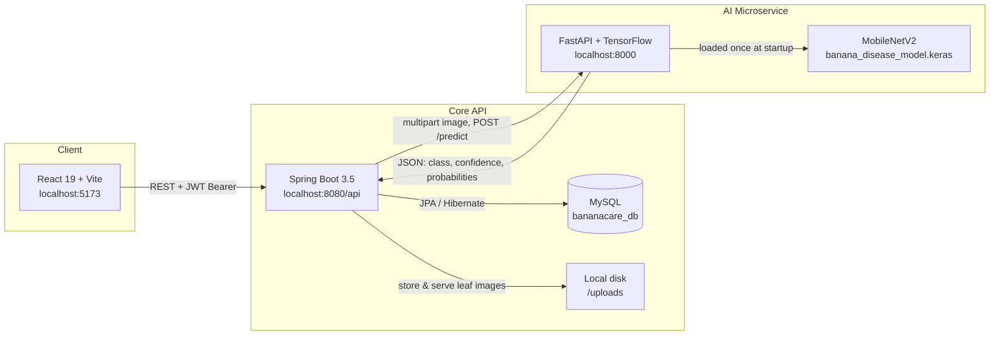
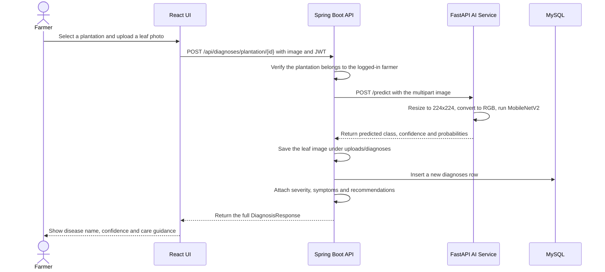
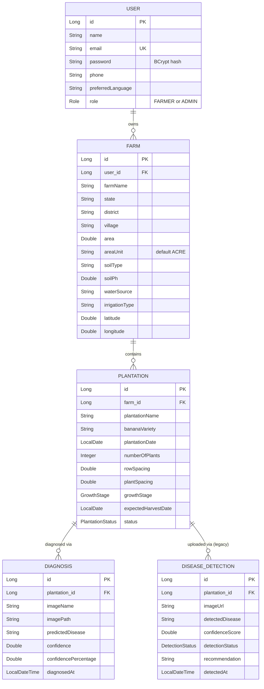
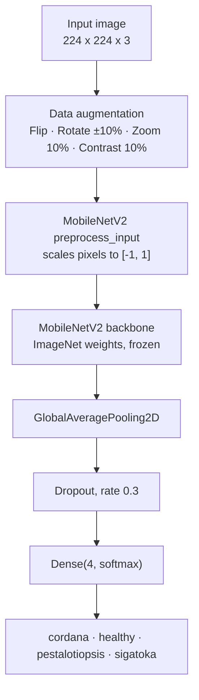

# 🍌 BananaCare — AI-Powered Banana Plant Disease Detection

*A full-stack precision-agriculture platform that lets a farmer photograph a banana leaf and get an instant, AI-backed diagnosis — plus farm and plantation tracking, diagnosis history, and treatment guidance.*

[](https://openjdk.org/)
[](https://spring.io/projects/spring-boot)
[](https://react.dev/)
[](https://vitejs.dev/)
[](https://www.python.org/)
[](https://www.tensorflow.org/)
[](https://www.mysql.com/)


BananaCare exists because banana crops lose significant yield every year to a small set of recurring leaf diseases — and by the time symptoms are obvious to the naked eye, the infection has often already spread. BananaCare puts a trained computer-vision model directly in a farmer's hands: upload a leaf photo, get a disease classification with a confidence score in seconds, and receive symptom and treatment guidance tied to that specific diagnosis — all while building a historical health record for every plantation the farmer manages.

---

## Table of Contents

- [Overview](#overview)
- [Key Features](#key-features)
- [Tech Stack](#tech-stack)
- [System Architecture](#system-architecture)
- [Request Lifecycle](#request-lifecycle)
- [Repository Structure](#repository-structure)
- [Data Model](#data-model)
- [The AI Model](#the-ai-model)
- [API Reference](#api-reference)
- [Getting Started](#getting-started)
- [Configuration Reference](#configuration-reference)
- [Usage Walkthrough](#usage-walkthrough)
- [Implementation Notes](#implementation-notes)
- [Roadmap](#roadmap)
- [Contributing](#contributing)
- [License](#license)
- [Author](#author)

---

## Overview

BananaCare is organized as **three independently runnable services** rather than one monolith:

| | |
|---|---|
| **Services** | 3 (React SPA, Spring Boot API, FastAPI ML service) |
| **Disease classes** | 4 (`cordana`, `healthy`, `pestalotiopsis`, `sigatoka`) |
| **Model** | MobileNetV2 transfer learning, 224×224 RGB input |
| **Training images** | 937 (70 / 15 / 15 train / validation / test split) |
| **REST endpoints** | 17, secured with stateless JWT auth |
| **Datastore** | MySQL 8, 5 core entities |

A farmer registers, adds one or more **Farms** (location, soil, irrigation profile), adds one or more **Plantations** under each farm (banana variety, planting date, spacing, growth stage), and can then diagnose any plantation by uploading a leaf photo. Every diagnosis is persisted, enriched with a severity rating, symptom list, and care recommendations, and rolled up into a per-plantation health summary.

## Key Features

- 🔐 **JWT authentication** with `FARMER` / `ADMIN` roles, BCrypt password hashing, and a stateless Spring Security filter chain
- 🌱 **Farm & plantation management** — full CRUD, scoped so a user can only ever see or modify their own records
- 📸 **One-shot AI leaf diagnosis** — upload an image, get back the predicted disease, a confidence score, and the full probability distribution across all four classes
- 📚 **Built-in disease knowledge base** — every prediction is automatically enriched with a severity rating, a symptom list, and actionable care recommendations
- 📈 **Diagnosis history & health summary** — per-plantation timeline of diagnoses plus an aggregated healthy/diseased breakdown and a computed health status (`HEALTHY` → `GOOD` → `MONITOR` → `ATTENTION_REQUIRED`)
- 🖥️ **Dashboard** summarizing farms, plantations, and the most recent diagnosis at a glance
- 🧩 **Decoupled ML microservice** — the inference engine is a separate FastAPI process, so the model can be retrained, redeployed, or scaled independently of the core API

## Tech Stack

<table>
<tr><td valign="top">

**Frontend**
- React 19.2
- Vite 8 (dev server / bundler)
- React Router DOM 7
- Axios (HTTP client + JWT interceptor)
- lucide-react (icons)
- oxlint (linting)

</td><td valign="top">

**Core API**
- Java 21
- Spring Boot 3.5.4
- Spring Security + JJWT 0.12.6
- Spring Data JPA / Hibernate
- MySQL 8 (`mysql-connector-j`)
- Lombok · Maven

</td><td valign="top">

**AI Microservice**
- Python 3
- FastAPI + Uvicorn
- TensorFlow / Keras 3
- MobileNetV2 (ImageNet transfer learning)
- Pillow · NumPy · scikit-learn

</td></tr>
</table>

## System Architecture

Each service owns a distinct responsibility and communicates over plain REST — the frontend never talks to the AI service directly, and the AI service knows nothing about users, farms, or persistence.



**Why split the AI service out?** TensorFlow inference has a very different resource profile (CPU/GPU-bound, large memory footprint, slow cold start) than a typical CRUD API. Keeping it as its own FastAPI process means it can be scaled, containerized, or swapped for a different model version without touching the Spring Boot codebase — the two only agree on a small JSON contract over `/predict`.

## Request Lifecycle

The diagnosis flow is the heart of the system — here's exactly what happens between a farmer tapping "Diagnose" and seeing a result:



Two authorization checks matter here: the Spring Boot layer confirms the requesting user actually owns the plantation (via `Plantation → Farm → User`) *before* the image is ever forwarded to the AI service, and the AI service itself is completely stateless — it never touches the database or knows which farmer sent the request.

## Repository Structure

```
BananaCare-AI-Plant-Disease-Detection/
├── bananacare-frontend/                 # React 19 + Vite SPA
│   └── src/
│       ├── api/axios.js                 # Shared Axios instance + JWT request/response interceptors
│       ├── services/                    # authService, farmService, plantationService, diagnosisService, aiService
│       ├── pages/                       # Login, Register, Dashboard, Farms, Plantations, Diagnose, DiagnosisHistory
│       ├── App.jsx                      # Route table
│       └── main.jsx                     # React entry point
│
├── bananacare-backend/                  # Spring Boot core API
│   ├── src/main/java/com/bananacare/
│   │   ├── config/                      # SecurityConfig (JWT + CORS), WebConfig (static /uploads serving)
│   │   ├── controller/                  # Auth, Farm, Plantation, Diagnosis, DiseaseDetection, AiPrediction, Test
│   │   ├── dto/                         # Request/response payloads
│   │   ├── entity/                      # User, Farm, Plantation, Diagnosis, DiseaseDetection + enums
│   │   ├── repository/                  # Spring Data JPA repositories
│   │   ├── security/                    # JwtService, JwtAuthenticationFilter, CustomUserDetailsService
│   │   └── service/                     # Business logic (ownership checks, orchestration, recommendations)
│   ├── src/main/resources/application.properties
│   ├── pom.xml
│   │
│   └── ai-service/                      # FastAPI ML microservice — nested here, but an independent Python process
│       ├── app.py                       # Inference API: GET /, GET /health, POST /predict
│       ├── requirements.txt
│       ├── model/
│       │   ├── banana_disease_model.keras
│       │   ├── class_names.json
│       │   └── train_model.py           # Model training script
│       ├── utils/
│       │   └── prepare_dataset.py       # Splits dataset/raw → dataset/processed (train/validation/test)
│       └── dataset/
│           ├── raw/{cordana,healthy,pestalotiopsis,sigatoka}/
│           └── processed/{train,validation,test}/{cordana,healthy,pestalotiopsis,sigatoka}/
│
└── README.md
```

> **Note on layout:** `ai-service/` lives physically inside `bananacare-backend/`, but it is **not** a Spring Boot module and has no build-time dependency on it — it's a standalone Python/FastAPI process that just happens to be nested in the folder tree. See [Getting Started](#getting-started) for how to run it on its own.

## Data Model



**Domain enumerations:**

| Enum | Values |
|---|---|
| `Role` | `FARMER`, `ADMIN` |
| `GrowthStage` | `PLANTED` → `VEGETATIVE` → `FLOWERING` → `FRUIT_DEVELOPMENT` → `HARVEST_READY` → `HARVESTED` |
| `PlantationStatus` | `ACTIVE`, `COMPLETED`, `FAILED`, `CANCELLED` |
| `DetectionStatus` | `PENDING`, `PROCESSING`, `HEALTHY`, `DISEASE_DETECTED`, `FAILED` |

All tables use Hibernate's identity-generation strategy and are created automatically on startup (`spring.jpa.hibernate.ddl-auto=update`) — there is no separate migration step for local development.

## The AI Model

### Dataset

Images are organized one class-per-folder under `ai-service/dataset/raw/`, then deterministically split 70 / 15 / 15 into `train`, `validation`, and `test` by `utils/prepare_dataset.py` (fixed seed `42`, so the split is reproducible run to run):

| Class | Severity | Raw images | Train | Validation | Test |
|---|---|---:|---:|---:|---:|
| `cordana` | Moderate | 162 | 113 | 24 | 25 |
| `healthy` | — | 129 | 90 | 19 | 20 |
| `pestalotiopsis` | Moderate | 173 | 121 | 25 | 27 |
| `sigatoka` | High | 473 | 331 | 70 | 72 |
| **Total** | | **937** | **655** | **138** | **144** |

The classes are meaningfully imbalanced — `sigatoka` alone accounts for roughly half the dataset — which is why training computes **inverse-frequency class weights** rather than relying on naive random sampling.

### Preprocessing & Augmentation

- Every image is resized to **224 × 224** and forced to RGB before it ever reaches the model.
- Training-time augmentation is implemented as Keras preprocessing layers (active only during training, not inference): `RandomFlip("horizontal")` → `RandomRotation(0.1)` → `RandomZoom(0.1)` → `RandomContrast(0.1)`.
- Pixel scaling uses `tf.keras.applications.mobilenet_v2.preprocess_input`, which rescales pixels into MobileNetV2's expected `[-1, 1]` range. Inspecting the exported `.keras` graph directly confirms this preprocessing is **baked into the saved model itself** (as `TrueDivide` → `Subtract` layers) — which is why `app.py` can hand the model raw 0–255 pixel values without re-implementing any normalization logic.

### Architecture

The model is a classic transfer-learning setup: a frozen ImageNet-pretrained backbone as a fixed feature extractor, with a small trainable classification head on top.



This was verified directly against the shipped `banana_disease_model.keras` artifact (a Keras v3 archive containing `config.json` + `model.weights.h5`), not just inferred from the training script:

| Stage | Layer | Configuration |
|---|---|---|
| 1 | `InputLayer` | shape `(224, 224, 3)` |
| 2 | `data_augmentation` (`Sequential`) | `RandomFlip`, `RandomRotation(0.1)`, `RandomZoom(0.1)`, `RandomContrast(0.1)` — training-only |
| 3 | `preprocess_input` (`TrueDivide` → `Subtract`) | folds MobileNetV2's `[-1, 1]` rescaling into the graph |
| 4 | `MobileNetV2` (nested `Functional` submodel) | ImageNet weights, `include_top=False`, `trainable=False` |
| 5 | `GlobalAveragePooling2D` | collapses backbone feature maps to a single vector |
| 6 | `Dropout` | `rate = 0.3` |
| 7 | `Dense` | `units=4`, `activation="softmax"`, Glorot-uniform init |

### Training Configuration

| Hyperparameter | Value |
|---|---|
| Base architecture | MobileNetV2, frozen, ImageNet-pretrained |
| Input size | 224 × 224 × 3 |
| Batch size | 16 |
| Max epochs | 20 (early stopping usually halts sooner) |
| Optimizer | Adam, `learning_rate = 0.001` |
| Loss | `sparse_categorical_crossentropy` |
| Class balancing | Manually computed inverse-frequency class weights |
| Metric | Accuracy |
| Random seed | 42 |

**Callbacks:**
- `ModelCheckpoint` — saves only the checkpoint with the best `val_accuracy`
- `EarlyStopping` — monitors `val_loss`, patience `5`, restores best weights
- `ReduceLROnPlateau` — monitors `val_loss`, factor `0.2`, patience `2`, `min_lr = 1e-6`

> The script evaluates the restored best checkpoint against the untouched 144-image test set and prints the final loss/accuracy to the console — this run-time result isn't currently persisted to a metrics file in the repo (see [Roadmap](#roadmap)), so re-run training locally if you want a current number rather than trusting a stale figure in documentation.

### Retraining the Model

```bash
cd bananacare-backend/ai-service
python -m venv venv
source venv/bin/activate        # Windows: venv\Scripts\activate
pip install -r requirements.txt

# 1. Re-split dataset/raw into dataset/processed/{train,validation,test}
python utils/prepare_dataset.py

# 2. Train — writes the best checkpoint to model/banana_disease_model.keras
python model/train_model.py
```

Add new labeled images under `dataset/raw/<class_name>/` (or a new class folder entirely) before running `prepare_dataset.py` to fold them into the next training run.

## API Reference

**Core API base URL:** `http://localhost:8080/api` · **Auth:** `Authorization: Bearer <jwt>` unless marked *Public*
**AI microservice base URL:** `http://localhost:8000` (internal — the frontend never calls this directly)

| Method | Endpoint | Auth | Description |
|---|---|---|---|
| `POST` | `/auth/register` | Public | Create a farmer/admin account |
| `POST` | `/auth/login` | Public | Authenticate and receive a JWT |
| `GET` | `/test/protected` | Bearer | Sanity-check that a token is valid |
| `GET` | `/farms` | Bearer | List the logged-in user's farms |
| `POST` | `/farms` | Bearer | Create a farm |
| `GET` | `/farms/{farmId}` | Bearer | Get one farm (must be the owner) |
| `PUT` | `/farms/{farmId}` | Bearer | Update a farm |
| `DELETE` | `/farms/{farmId}` | Bearer | Delete a farm |
| `POST` | `/plantations` | Bearer | Create a plantation under a farm |
| `GET` | `/plantations/farm/{farmId}` | Bearer | List plantations for a farm |
| `GET` | `/plantations/{plantationId}` | Bearer | Get one plantation |
| `PUT` | `/plantations/{plantationId}` | Bearer | Update a plantation |
| `POST` | `/diagnoses/plantation/{plantationId}` | Bearer | Upload a leaf image, run AI diagnosis, persist and return the result |
| `GET` | `/diagnoses/plantation/{plantationId}` | Bearer | Diagnosis history for a plantation, newest first |
| `GET` | `/diagnoses/plantation/{plantationId}/summary` | Bearer | Aggregated health stats for a plantation |
| `POST` | `/disease-detections/upload` | Bearer | *(legacy)* Store a leaf image against a plantation with `PENDING` status |
| `POST` | `/ai/predict` | Bearer | Direct pass-through to the AI service — classification only, not persisted |

### Example — Register

```http
POST /api/auth/register
Content-Type: application/json

{
  "name": "Asha Patil",
  "email": "asha@example.com",
  "password": "SecurePass123",
  "phone": "9876543210",
  "preferredLanguage": "ENGLISH"
}
```

### Example — Login

```http
POST /api/auth/login
Content-Type: application/json

{
  "email": "asha@example.com",
  "password": "SecurePass123"
}
```

```json
{
  "token": "eyJhbGciOiJIUzI1NiIs...",
  "tokenType": "Bearer",
  "userId": 1,
  "name": "Asha Patil",
  "email": "asha@example.com",
  "role": "FARMER"
}
```

### Example — Diagnose a Leaf

```bash
curl -X POST http://localhost:8080/api/diagnoses/plantation/1 \
  -H "Authorization: Bearer <token>" \
  -F "image=@leaf.jpg"
```

```json
{
  "id": 12,
  "plantationId": 1,
  "imageUrl": "/uploads/diagnoses/6c2e19f0-....jpg",
  "predictedDisease": "sigatoka",
  "confidence": 0.9421,
  "confidencePercentage": 94.21,
  "diagnosedAt": "2026-08-04T10:15:30",
  "diseaseInfo": {
    "diseaseName": "sigatoka",
    "displayName": "Sigatoka Leaf Spot",
    "severity": "HIGH",
    "description": "Sigatoka is an important fungal leaf-spot disease of banana...",
    "symptoms": ["Small streaks or spots on banana leaves", "..."],
    "recommendations": ["Regularly inspect the plantation for affected leaves", "..."]
  }
}
```

The `/summary` endpoint additionally computes a `plantationHealthStatus` bucket from the diseased-image percentage across all of a plantation's diagnoses:

| Diseased % | Status |
|---|---|
| No diagnoses yet | `NO_DATA` |
| 0% | `HEALTHY` |
| ≤ 30% | `GOOD` |
| ≤ 60% | `MONITOR` |
| \> 60% | `ATTENTION_REQUIRED` |

## Getting Started

### Prerequisites

- **Java 21** (JDK)
- **Maven 3.9+** (no wrapper is committed — install Maven or run via your IDE)
- **Node.js 20 LTS+** and npm
- **Python 3.10+**
- **MySQL 8.x**, running locally or reachable over the network
- **Git**

### 1. Clone the repository

```bash
git clone https://github.com/chetan-patil17/BananaCare-AI-Plant-Disease-Detection.git
cd BananaCare-AI-Plant-Disease-Detection
```

### 2. Create the database

```sql
CREATE DATABASE bananacare_db;
```

The schema (tables, columns, constraints) is created automatically on first backend startup — no manual migration scripts to run.

### 3. Start the AI microservice — port `8000`

```bash
cd bananacare-backend/ai-service
python -m venv venv
source venv/bin/activate        # Windows: venv\Scripts\activate
pip install -r requirements.txt
uvicorn app:app --reload --port 8000
```

Verify it's up: `curl http://localhost:8000/health`

### 4. Start the Spring Boot API — port `8080`

Edit `bananacare-backend/src/main/resources/application.properties` with your local MySQL username/password (see [Configuration Reference](#configuration-reference)), then:

```bash
cd bananacare-backend
mvn spring-boot:run
```

### 5. Start the React frontend — port `5173`

```bash
cd bananacare-frontend
npm install
npm run dev
```

Open **http://localhost:5173** — register an account and you're in.

> Start order matters a little: MySQL → AI service → backend → frontend. The backend will still boot without the AI service running, but any call to `/api/ai/predict` or `/api/diagnoses/**` will fail until it's up.

## Configuration Reference

| Setting | Location | Default | Notes |
|---|---|---|---|
| `server.port` | `application.properties` | `8080` | Spring Boot HTTP port |
| `spring.datasource.url` | `application.properties` | `jdbc:mysql://localhost:3306/bananacare_db` | MySQL connection string |
| `spring.datasource.username` / `password` | `application.properties` | `root` / *(local only)* | **Set your own values before running** — see the security note below |
| `jwt.secret` | `application.properties`, overridable via `JWT_SECRET` env var | dev fallback string | HMAC signing key for JWTs — override this in any environment beyond local dev |
| `jwt.expiration` | `application.properties` | `86400000` (24h, in ms) | JWT validity window |
| AI service URL | hardcoded in `AiPredictionService.java` | `http://localhost:8000` | Where the backend looks for the FastAPI model service |
| Frontend API URL | hardcoded in `src/api/axios.js`, `src/services/api.js` | `http://localhost:8080/api` | Where the SPA looks for the backend |
| CORS allowed origins | hardcoded in `SecurityConfig.java` | `http://localhost:5173`, `http://127.0.0.1:5173` | Update if you serve the frontend from another origin/port |

> **Security note:** `application.properties` currently ships with a placeholder local MySQL password and a development JWT secret committed directly in the file. `jwt.secret` already supports override via a `JWT_SECRET` OS environment variable (Spring resolves `${JWT_SECRET:default}` automatically), and the same `${VAR:default}` pattern is straightforward to apply to the datasource credentials. Do this before deploying anywhere beyond `localhost`, and rotate any secret that was ever committed to version control.

## Usage Walkthrough

1. **Register** an account from the Register page.
2. **Log in** — the JWT is stored in `localStorage` and attached automatically to every subsequent request.
3. **Add a Farm** — location, area, soil type/pH, water source, irrigation type, and optional GPS coordinates.
4. **Add a Plantation** under that farm — banana variety, planting date, plant count, row/plant spacing.
5. Go to **Diagnose**, pick the plantation, and upload a clear photo of a banana leaf.
6. Instantly see the predicted disease, confidence score, severity, symptoms, and recommendations.
7. Revisit **Diagnosis History** for a timeline per plantation, or the **Dashboard** for an overview across every farm and plantation you manage.

## Implementation Notes

A few things worth knowing if you're extending this codebase:

- **Two parallel detection pipelines exist.** `Diagnosis` (`/api/diagnoses/**`) is wired end-to-end to the AI service and the recommendation engine — it's what the Diagnose page actually uses. `DiseaseDetection` (`/api/disease-detections/upload`) currently only stores the uploaded image and creates a `PENDING` record without calling the model. Worth consolidating, or finishing the wiring on the latter.
- **Two near-identical Axios instances** live in the frontend (`src/api/axios.js` and `src/services/api.js`), both pointing at the same base URL with similar interceptor logic — safe to merge into one shared client.
- **`ddl-auto=update`** is convenient for local development but isn't recommended for production schema management; consider Flyway or Liquibase migrations as the schema stabilizes.
- **No automated test coverage yet** beyond the default Spring Boot context-load test (`BananaCareApplicationTests`); no CI pipeline or Dockerfiles are currently present in the repo.
- **No `LICENSE` file** is currently included — see [License](#license).

## Roadmap

- [ ] Persist model evaluation metrics (accuracy, confusion matrix) per training run
- [ ] Externalize all secrets and service URLs via environment variables / Spring profiles
- [ ] Add Dockerfiles + Docker Compose for one-command local startup of all three services plus MySQL
- [ ] Add automated tests — JUnit for the backend, pytest for the AI service, component tests for the frontend
- [ ] CI pipeline (build, lint, test) via GitHub Actions
- [ ] Expand the disease taxonomy beyond the current four classes, with more region-diverse training images
- [ ] Track model experiments/versions (e.g., MLflow) instead of a single overwritten checkpoint file
- [ ] Localize the UI — the `preferredLanguage` field already exists on `User` but isn't used for i18n yet
- [ ] Add a `LICENSE`

## Contributing

1. Fork the repository and create a feature branch: `git checkout -b feature/your-feature`
2. Make your changes, following the existing package/folder conventions in each service
3. Commit with a clear message and push to your fork
4. Open a pull request describing what changed and why

Since the project doesn't yet have CI, please manually verify the backend builds (`mvn clean verify`), the frontend builds (`npm run build`), and the AI service still loads and serves `/predict` correctly before opening a PR.

## License

This repository does not currently include a `LICENSE` file. Until one is added, please treat the code as all-rights-reserved by the author and reach out before reusing it elsewhere. If you'd like others to freely use, modify, or distribute this project, consider adding the [MIT License](https://choosealicense.com/licenses/mit/) or another OSI-approved license.

## Author

**Chetan Patil**
GitHub: [@chetan-patil17](https://github.com/chetan-patil17)
